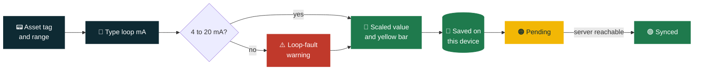
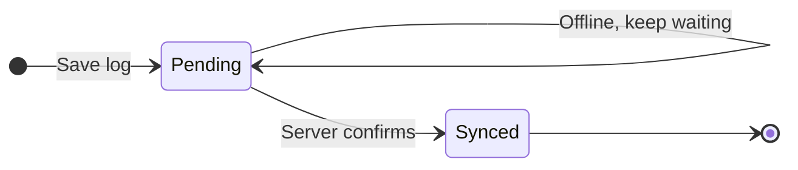
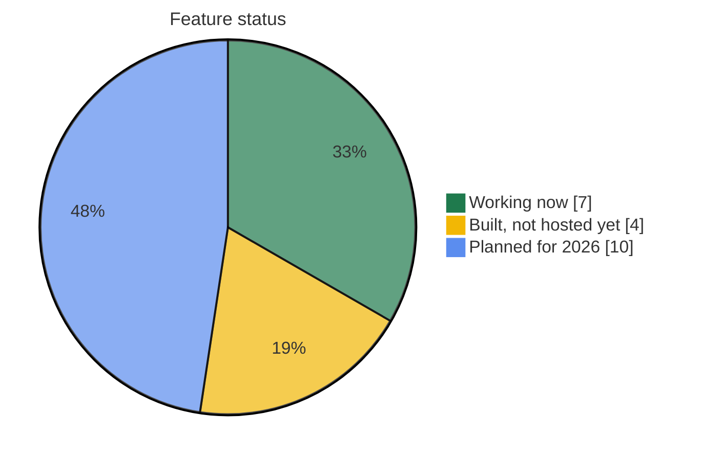

<div align="center">


# Commissioning & Calibration Toolkit

**Log 4-20 mA loop calibrations in the field, even with no signal.**


### [Open the live app](https://esp046-cyber.github.io/Commissioning-Calibration-Toolkit-/)

</div>

---

## What it does

Built for controls engineers in water and wastewater. Type the loop current from your calibrator, and the app converts it to an engineering value, flags faults and keeps a log on the device.

| | Feature | How it works |
|---|---|---|
| 📟 | **Log a reading** | Asset tag (auto-capitalised, e.g. `FIT-103`), instrument type, range, unit and loop current. |
| 📏 | **Instant scaling** | 4-20 mA is converted to your range as you type. 12 mA on 0-100 m shows 50 m. |
| 🟨 | **Loop bar** | A yellow bar shows where the reading sits between 4 and 20 mA. |
| ⚠️ | **Fault warning** | Below 4 mA or above 20 mA triggers a loop-fault warning. You can still save the reading. |
| 💾 | **Safe saving** | Save stays disabled until tag, technician and mA are filled in. Your name is remembered. |
| 📋 | **Log table** | Tag, type, mA, value, technician, time and status, newest first. |
| 📶 | **Status bar** | Shows Online/Offline and how many logs are waiting to sync. |

---

## How a reading flows



### Log status



---

## 4-20 mA scaling

`value = low + (mA - 4) / 16 x (high - low)`

Example on a **0-100 m** level range:

| Loop current | Position in range | Reading |
|---|---|---|
| 4 mA | ⬜⬜⬜⬜⬜⬜⬜⬜ 0% | 0 m |
| 8 mA | 🟨🟨⬜⬜⬜⬜⬜⬜ 25% | 25 m |
| 12 mA | 🟨🟨🟨🟨⬜⬜⬜⬜ 50% | 50 m |
| 16 mA | 🟨🟨🟨🟨🟨🟨⬜⬜ 75% | 75 m |
| 20 mA | 🟨🟨🟨🟨🟨🟨🟨🟨 100% | 100 m |
| under 4 or over 20 mA | 🟥🟥🟥🟥🟥🟥🟥🟥 | ⚠️ loop-fault warning |

**Units:** L/s and m³/h (flow), bar and PSI (pressure), m and % (level). The unit is a label only, with no conversion between units.

---

## 2026 feature status



### ✅ Working now
- Calibration log form with instant 4-20 mA scaling
- Yellow loop bar and loop-fault warning
- Save validation and remembered technician name
- Saved-logs table with Pending/Synced status
- Online/Offline status bar with pending count
- Offline storage on the device (IndexedDB)
- Installable app shell with a service worker

### 🛠 Built, not hosted yet
- Backend API with a PostgreSQL schema and audit fields
- Retry queue for forwarding logs to a SCADA gateway
- Docker, nginx and a CI pipeline that builds the images

Until a backend is hosted, logs stay **Pending** and live only in the browser on that device.

### 🗺 Planned for 2026
- [ ] 📲 Home-screen install fix for the GitHub Pages address
- [ ] 📤 CSV export
- [ ] ✏️ Edit, delete, search and filter logs
- [ ] ✅ Pass/fail tolerance check
- [ ] 🎯 Multi-point calibration (as-found and as-left)
- [ ] 📷 Photo and signature capture
- [ ] 🔐 Login and on-device encryption
- [ ] 🧰 More equipment types, such as macerators
- [ ] 🔁 Unit conversion
- [ ] 🌐 More languages

> Offline behaviour uses the standard PWA approach but still needs a field test on real devices.

---

## Run it yourself

```bash
npm install
npm run build && npm run preview   # the service worker only registers in production builds
```

Deploy to GitHub Pages:

```bash
npx vite build --base=/Commissioning-Calibration-Toolkit-/
npx gh-pages -d dist
```

## Project layout

```text
src/
  components/
    CalibrationForm.tsx   input form, scaling, loop bar
    SyncStatus.tsx        online/offline and pending count
    LogViewer.tsx         saved logs table
  api/avevaSync.ts        sends logs to the sync endpoint
  db.ts                   local database (Dexie / IndexedDB)
  sw.js                   service worker and retry queue
server/                   backend API and database schema
```

## Security note

There is no login yet and logs on the device are not encrypted. Don't store sensitive data until that is added.
